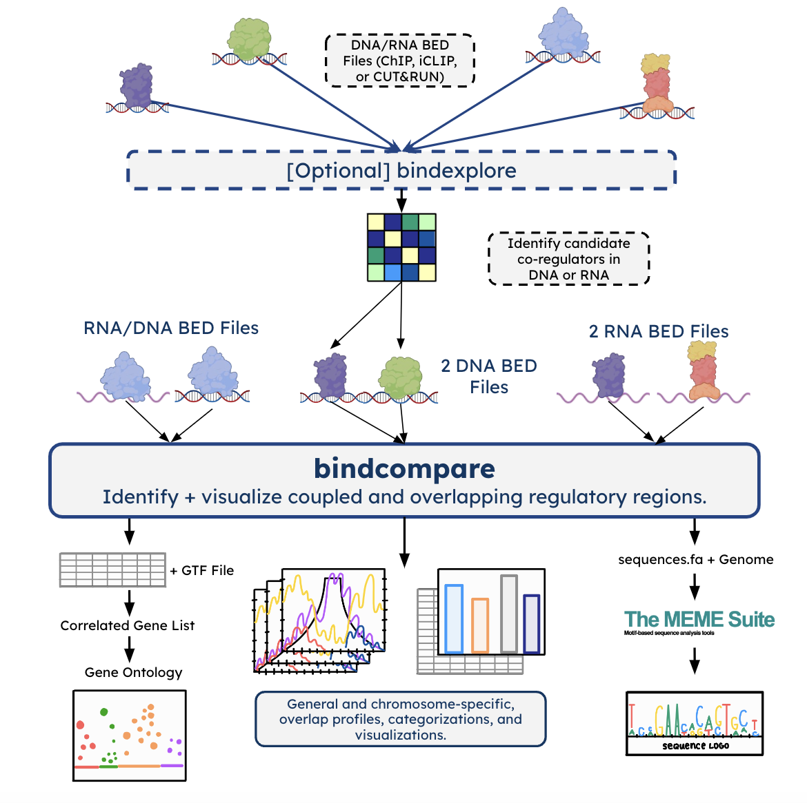
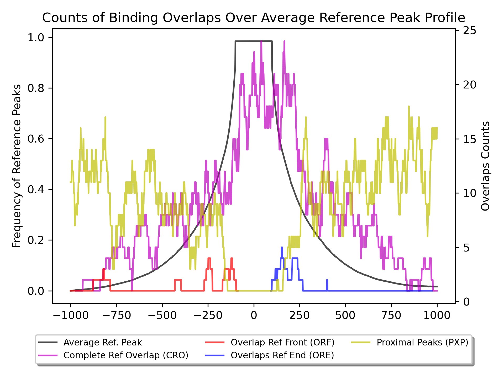
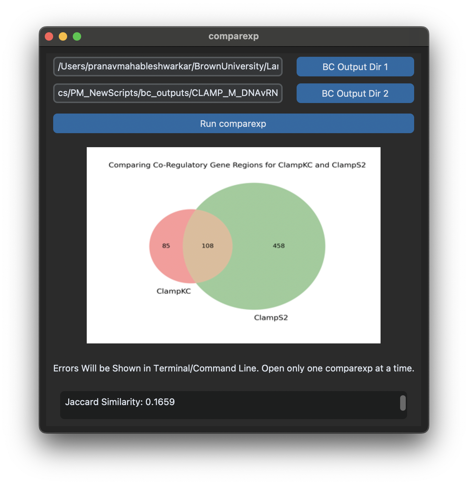

.. image:: ./README_imgs/bclogo.png
   :align: center
   :width: 300

Installation
============

BindCompare is accessible through the PyPI system and the Command Line/Terminal.
If these are not setup on your device, here is a user-tutorial you should
follow first. To make sure that ``pip`` and ``python`` (must be version 3+) are 
properly installed, running the following should produce no errors.

.. code-block:: bash

   python3 --version
   pip --version

Once you have installed pip and python, you can run this 
command in your CLI/Terminal. 

.. code-block:: bash

   pip install --upgrade #TODO: fix this.
   pip install bindcompare

Now, you have installed BindCompare! This should have added the following five
commands: ``bindcompare``, ``bindexplore``, ``comparexp``, ``bindlaunch``
and ``retrievedm6``. If you want to pull the source code, directions are found
at the bottom of the documentation. 

Introduction
============

BindCompare is a novel integrated protein-binding analysis platform
designed to be user-accessible and interpretable. Given protein-binding
sites on DNA and/or RNA, BindCompare determines and visualizes domains
of co-regulatory activity at the single-nucleotide level.

The main function, ``bindcompare``, performs comparitive binding analysis 
for two sets of peak-called protein-binding data (either on RNA or DNA),
elucidating specific domains of co-regulation. Further, it visualizes 
such activity, categorizes overlapping binding domains, and prepares 
such regions for gene ontology analysis and motif discovery. 

Auxilary functionality includes ``bindexplore`` and ``comparexp``. Given N sets 
of protein-binding data, ``bindexplore`` applies pair-wise comparisons to 
find which proteins interact with the greatest frequency - visualized
through a heatmap. In ``bindcompare``, you are given the option of providing
an Genes GTF file to automatically extract correlated genes. ``comparexp``,
as a part of the downstream analysis, allows you to compare the co-regulatory
regions in two different bindcompare runs. 

At the core of BindCompare is defining overlapping binding domains. 
Oftentimes, co-regulation with factors occurs across a larger locus 
surrounding the marked binding site. BindCompare searches and categorizes
overlaps across a scoped regions containing the reference binding sites. 
Because BindCompare utilizes BED files, it enables the comparison between 
RNA and DNA binding sites, aiding the study of system wide 
co-transcriptional regulation.

To support user-accessible software, BindCompare can be launched in a GUI
interface that allows for easy application of bindcompare and comparexp.

Using BindCompare
=================

Here is a general overview of BindCompare usage in the following schematic.

As aforementioned, ``bindcompare`` and ``comparexp`` can be run through a tkinter
GUI interface. All of the commands can be run from the command line. How to use
BindCompare is presented for both the GUI and command line approaches. To launch
the GUI:

.. code-block:: bash

   bindlaunch

That should launch a platform that looks like this:

.. image:: README_imgs/bindlaunch.png
   :align: center
   :width: 300

``bindcompare``
---------------

``bindcompare`` takes in two peak-called BED files from programs such as MACS2 and
SEACR. One is denoted as teh reference or base file and the other is the experimental
or overlayed file. For each binding site in the experimental file, BindCompare
searches for every overlapping reference binding site, also identifying experimental peaks
that exist within a scoped region from the peak. This scoped regions relates to the fact
that co-regulatory activity can occur across a broad region and can be changed by the user.

This mini-schematic shows the general idea of overlapping peaks versus proximal peaks.

.. image:: ./README_imgs/BindCompareDemo1.png
   :align: center
   :width: 300

For both the GUI and command line approach, the following seven input options exist.

#. *Base Bed File Path:* The file path for your reference BED file. If comparing DNA and RNA, then this should be the filepath for the DNA BED file or more generally, the BED file with the larger peak size.
#. *Overlayed Bed File Path:* Enter the file path for your overlayed BED file.
#. *Scope:* How many nucleotides upstream and downstream from the reference peak’s center that BindCompare will search for an overlap. Making this value smaller will decrease the number of overlaps and vice versa.
#. *Sample Name:* A short phrase to label the experiment (i.e. CLAMP)
#. *Output Folder:* A folder’s file path where all of the outputs will be generated (will be created if it does not exist).
#. *Genes GTF File:* This file details the chrom location of every gene in your organism. Enter ``None`` if you do not have it.
#. *Genome FA File Path:* A FA file with a corresponding fa.fai (index file) for BedTools to extract sequences of binding sites. Enter ``None`` if you do not have it.

If your BED files are for *D. Melanogaster* in the dm6 build, you may run in the command-line:

.. code-block:: bash

   retrievedm6

This will automatically download the dm6 FASTA file and genes GTF file. Right now this is only
supported for *D. Melanogaster*. 

Using the GUI
^^^^^^^^^^^^^
When you launch the app using ``bindlaunch``, enter all of the files into the appropriate rows.
Other than *scope* and *sample name*, you can utilize the built-in file-finder to
choose the correct file you are interested in using. Note that this will force you to have already
created the output directory as you would otherwise be unable to select it.

Once you have filled all of the inputs in, you can click the blue Run BindCompare button. If there
is any outputs or errors, this will show up in your terminal - not in the app. Once BindCompare
has completed, the status bar should change to reflect this. 

Finally, on the right hand side you can choose to do mini-visualizations of the plots generated. If
you choose the same output directory, the dropdown menu will populate all of the images in that folder.
Then, you can choose to visualize any of them (in a compressed format). A help menu in the app contains
a summarized meaning of each plot to remind you what you are looking at. 

Command Line
^^^^^^^^^^^^

In your command line, enter:

.. code-block:: bash

   # help command
   bindcompare
   # run a bindcompare experiment
   bindcompare <ref bed> <exp bed> <scope: int> <sample name> <output dir> <GTF|None> <FA|None>

Understanding the Results
^^^^^^^^^^^^^^^^^^^^^^^^^
Overlap Profile (_ref_freq.png)
~~~~~~~~~~~~~~~~~~~~~~~~~~~~~~~

This is a sample overlap profile. An overlap is defined in four ways: 
1. Completely overlapping (purple lines, CRO). 2. Partially
overlapping at the DNA peak start site (red lines, ORF). 3.
Partially overlapping at the DNA peak end site (blue lines, ORE) 
4. Non-overlapping but proximal, i.e. when there is an peak in a region
outside the reference binding site (yellow lines, PXP). Note that
these are categories are for experimental peaks overlayed on a reference peak.

This extended region is defined by the scope variable in the script,
allowing the overlap to look for binding sites in the proximity of the
binding site (this scope is 2 kb including the DNA binding site). It
should be noted that multiple experimental peaks can overlap with one
reference peak and vice versa. Counts of these overlaps are placed onto 
a [-scope, scope] region. Then,each type of overlap shown with a different 
color is overlaid and plotted onto a frequency plot. So, if the frequency 
at a given base pair is 5, then there are five overlaps that contained that 
base pair within the region defined by the scope.

In black, the average peak/peak-size of the reference BED file is shown. 

Oftentimes, it can be valuable to see **where** this split is occurring!
The values derived for the above plot can be `split over all
chromsomes <https://github.com/pranavmahabs/bindcompare/blob/main/SampleOut/ClampKC_chrom_ref_freq.png>`__.

Bar Summary (_barsummary.png)
~~~~~~~~~~~~~~~~~~~~~~~~~~~~~

.. image:: ./README_imgs/barsummary.png
   :align: center
   :width: 200

Exp. Binding Peaks references the number of peaks or rows that are in
the overlayed bed file. Unique overlaps references the number of unique
peaks in the overlayed BED file that were found to overlap with a peak
in the base/reference BED file. The total number of overlaps simply
references how many times an experimental peak overlapped with a reference peak. Note
that there can be repeats here! Then, the next two values are the same but provide
the counts for the number of proximal peaks found in scoped regions. Finally, 
the last column is the number of unique reference/base peaks that were 
found within an overlap or proximal peak event.

Distribution Plots
~~~~~~~~~~~~~~~~~~

There is a stacked bar plot and pie chart that shows the number of
each overlap event type that occurred. These are split across the
four categories CRO, ORF, ORE, and PXP. 

Summary File and CSV Output
~~~~~~~~~~~~~~~~~~~~~~~~~~~

The CSV file contains one row for every reference peak that was involved
in an overlap. This includes the Chromosome, Beginning/Ending Coordinate
of the peak, the corresponding nucleotide sequence, the type of overlap
(as described above), and the Gene IDs/sequence that correspond to that region
if the GTF/Genome file is provided. 

Further, in a sub-directory, the CSV values are split by overlap type. Because
one reference peak can be involved with many different types of overlaps it is
possible for it to appear in multiple subcategorized CSV files. 

The summary file contains the average peak size for both of the BED
files. Additionally, it prints all of the found Gene IDs that are in the
CSV file so that they can be easily converted to gene names.

``bindexplore``
---------------

If you are interested in taking N BED files for N different binding
experiments, you can visualize pair-wise binding overlaps across all
experiments to select candidate pairs for BindCompare. This script,
right now, can only be run from the terminal:

.. code-block:: bash

   bindexplore <scope> <bed_file_1> <bed_file_2> ... <bed_file_n>

The ``scope`` value essentially bins the genome into bins of size
``scope``. Then, it uses this size to search for overlaps within each
bin. Then a heatma is generated to visualize binding overlaps and can be
seen below. The math for each cell is as follows:

.. code-block:: latex

   \frac{\text{Num Ref Binds found in Overlayed Sites}}{\text{Num Ref Binds}}

.. image:: README_imgs/explore.png
   :align: center
   :width: 200

In this example, we see that we are comparing CLAMP binding in KC and S2
Cells, GAF Binding, and MLE Binding. Understandably, CLAMP KC and S2 has
a significant overlap!

``comparexp``
-------------
This is a simple way to compare and visualize two ``bindcompare`` runs. 
This is only possible if you provided a GTF file. Make sure that your
original summary file is in the ``bindcompare`` output directory you provide.

Given two directories for ``bindcompare`` outputs, ``comparexp`` will produce
a weighted Venn Diagram based on the genes present in each of the categories.
In a summary file, the program will also provide the jaccard similarity score
in addition to the names of the genes in each category (comma separated so that
it can be easily input into Gene Ontology platforms).

The output names for these files will have the prefix "samplename1_v_samplename2"
where each sample name is extracted from the name of the summary file. They will
be saved in the folder from which you launched the GUI or where you run ``comparexp``.

Using the GUI
^^^^^^^^^^^^^
When you launch the app using ``bindlaunch``, you may click the `comparexp`
button. This will launch another mini window. There, you can enter in the 
file paths for two folders that contain BindCompare summary files with gene
lists and click run. The output and GUI should look like this:

As you can see, the venn diagram is rendered and the entire summary file
will also be dumped below in the text box. 

Command Line
^^^^^^^^^^^^
The same functionality can also be achieved through the command line. 
.. code-block:: bash

   comparexp <bindcompare outdir 1> <bindcompare outdir 2>

Credits
=======

This was script was written at Brown University in the `Larschan
Lab <https://www.larschanlab.com>`__ by Pranav Mahableshwarkar under
the guidance of Mukulika Ray, PhD and Erica Larschan, PhD. 

If you want to pull the source-code, this can be done via github. 
.. code-block:: bash

   git pull https://github.com/pranavmahabs/bindcompare.git

Please leave any messages here regarding errors or issues found in using the platform. 