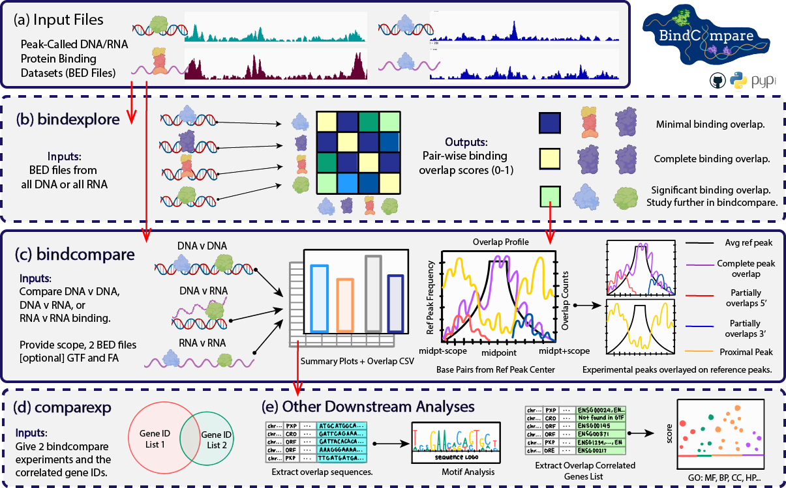
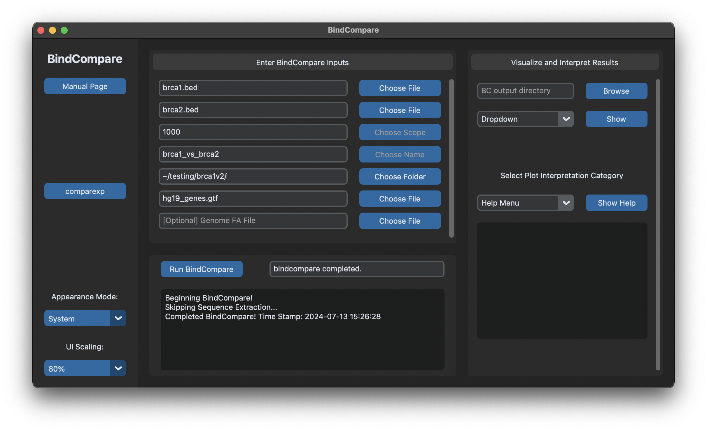

.. image:: ./docs/images/bclogo.png
   :align: center
   :width: 300

.. toctree:: 
   :maxdepth: 2

   Introduction
   docs/installation
   Using BindCompare
   docs/bindcompare
   docs/bindexplore
   docs/comparexp
   Credits

Introduction
============

BindCompare is a novel integrated protein-binding analysis platform
designed to be user-accessible and interpretable. Given protein-binding
sites on DNA and/or RNA, BindCompare determines and visualizes domains
of co-regulatory activity at the single-nucleotide level.

The main function, ``bindcompare``, performs comparitive binding analysis 
for two sets of peak-called protein-binding data (either on RNA or DNA),
elucidating specific domains of co-regulation. Further, it visualizes 
such activity, categorizes overlapping binding domains, and prepares 
such regions for gene ontology analysis and motif discovery. 

Auxilary functionality includes ``bindexplore`` and ``comparexp``. Given N sets 
of protein-binding data, ``bindexplore`` applies pair-wise comparisons to 
find which proteins interact with the greatest frequency - visualized
through a heatmap. In ``bindcompare``, you are given the option of providing
an Genes GTF file to automatically extract correlated genes. ``comparexp``,
as a part of the downstream analysis, allows you to compare the co-regulatory
regions in two different bindcompare runs. 

At the core of BindCompare is defining overlapping binding domains. 
Oftentimes, co-regulation with factors occurs across a larger locus 
surrounding the marked binding site. BindCompare searches and categorizes
overlaps across a scoped regions containing the reference binding sites. 
Because BindCompare utilizes BED files, it enables the comparison between 
RNA and DNA binding sites, aiding the study of system wide 
co-transcriptional regulation.

To support user-accessible software, BindCompare can be launched in a GUI
interface that allows for easy application of bindcompare and comparexp.

Using BindCompare
=================

Here is a general overview of BindCompare usage in the following schematic.

As aforementioned, ``bindcompare`` and ``comparexp`` can be run through a tkinter
GUI interface. All of the commands can be run from the command line. This includes
``retrievedm6`` and ``bindexplore``. How to use BindCompare is presented for both 
the GUI and command line approaches. To launch the GUI:

.. code-block:: bash

   bindlaunch

That should launch a platform that looks like this:

Please visit the command specific pages for each of the above commands to learn more
about how to use BindCompare. 

Credits
=======

This was script was written at Brown University in the `Larschan
Lab <https://www.larschanlab.com>`__ by Pranav Mahableshwarkar under
the guidance of Mukulika Ray, PhD and Erica Larschan, PhD. 

If you want to pull the source-code, this can be done via github. 

.. code-block:: bash

   git pull https://github.com/pranavmahabs/bindcompare.git

Please leave any messages here regarding errors or issues found in using the platform. 