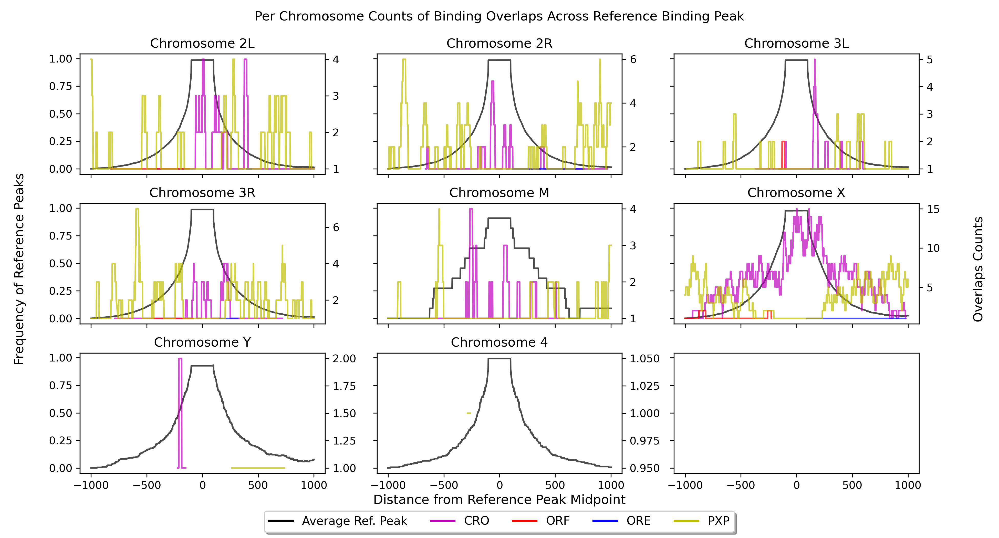
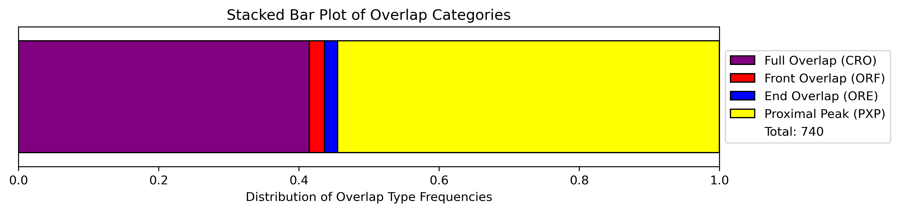

``bindcompare``
===============

``bindcompare`` takes in two peak-called BED files from programs such as MACS2 and
SEACR. One is denoted as teh reference or base file and the other is the experimental
or overlayed file. For each binding site in the experimental file, BindCompare
searches for every overlapping reference binding site, also identifying experimental peaks
that exist within a scoped region from the peak. This scoped regions relates to the fact
that co-regulatory activity can occur across a broad region and can be changed by the user.

This mini-schematic shows the general idea of overlapping peaks versus proximal peaks.

.. image:: ./images/BindCompareDemo1.png
   :align: center
   :width: 300

For both the GUI and command line approach, the following seven input options exist.

#. *Reference Bed File Path:* The file path for your reference BED file. If comparing DNA and RNA, then this should be the filepath for the DNA BED file or more generally, the BED file with the larger peak size.
#. *Overlayed Bed File Path:* Enter the file path for your overlayed BED file.
#. *Scope:* How many nucleotides upstream and downstream from the reference peak’s center that BindCompare will search for an overlap. Making this value smaller will decrease the number of overlaps and vice versa.
#. *Sample Name:* A short phrase to label the experiment (i.e. CLAMP)
#. *Output Folder:* A folder’s file path where all of the outputs will be generated (will be created if it does not exist).
#. *Genes GTF File:* This file details the chrom location of every gene in your organism. Omit the option if you do not have it. 
#. *Genome FA File Path:* A FA file with a corresponding fa.fai (index file) for BedTools to extract sequences of binding sites. Omit the option if you do not have it. 

If you are comparing anything containing DNA, we recommend a scope of 1000bp. If only comparing RNA, a scope of 250bp will suffice. 

If your BED files are for *D. Melanogaster* in the dm6 build, you may run in the command-line:

.. code-block:: bash

   retrievedm6

This will automatically download the dm6 FASTA file and genes GTF file. Right now this is only
supported for *D. Melanogaster*. It is important that for your GTF file that the attribute column
contains the "gene_id" attribute as documented `here <https://genome.ucsc.edu/goldenPath/help/GTF.html#:~:text=GTF%20(Gene%20Transfer%20Format%2C%20GTF2,inter%2C%20inter_CNS%2C%20and%20intron_CNS.>`__.

Using the GUI
-------------
When you launch the app using ``bindlaunch``, enter all of the files into the appropriate rows.
Other than *scope* and *sample name*, you can utilize the built-in file-finder to
choose the correct file you are interested in using. Note that this will force you to have already
created the output directory as you would otherwise be unable to select it.

Once you have filled all of the inputs in, you can click the blue Run BindCompare button. If there
is any outputs or errors, this will show up in your terminal - not in the app. Once BindCompare
has completed, the status bar should change to reflect this. 

Finally, on the right hand side you can choose to do mini-visualizations of the plots generated. If
you choose the same output directory, the dropdown menu will populate all of the images in that folder.
Then, you can choose to visualize any of them (in a compressed format). A help menu in the app contains
a summarized meaning of each plot to remind you what you are looking at. 

Command Line
------------

In your command line, enter:

.. code-block:: bash

   # help command
   bindcompare -h 
   # run a bindcompare experiment
   bindcompare -r REF -e EXP -s SCOPE -n NAME -o OUT [-g GTF] [-f FASTA]

Understanding the Results
-------------------------
Overlap Profile (_ref_freq.png)
^^^^^^^^^^^^^^^^^^^^^^^^^^^^^^^

.. image:: ./images/ref_freq.png
   :align: center
   :width: 220

This is a sample overlap profile. An overlap is defined in four ways: 
1. Completely overlapping (purple lines, CRO). 2. Partially
overlapping at the DNA peak start site (red lines, ORF). 3.
Partially overlapping at the DNA peak end site (blue lines, ORE) 
4. Non-overlapping but proximal, i.e. when there is an peak in a region
outside the reference binding site (yellow lines, PXP). Note that
these are categories are for experimental peaks overlayed on a reference peak.

This extended region is defined by the scope variable in the script,
allowing the overlap to look for binding sites in the proximity of the
binding site (this scope is 2 kb including the DNA binding site). It
should be noted that multiple experimental peaks can overlap with one
reference peak and vice versa. Counts of these overlaps are placed onto 
a [-scope, scope] region. Then,each type of overlap shown with a different 
color is overlaid and plotted onto a frequency plot. So, if the frequency 
at a given base pair is 5, then there are five overlaps that contained that 
base pair within the region defined by the scope.

In black, the average peak/peak-size of the reference BED file is shown. 

Oftentimes, it can be valuable to see **where** this split is occurring!
The values derived for the above plot can be split over all
chromsomes. In the example below, we see that co-regulatory activity is
concentrated on the X chromosome. 

Bar Summary (_barsummary.png)
^^^^^^^^^^^^^^^^^^^^^^^^^^^^^

.. image:: ./images/barsummary.png
   :align: center
   :width: 220

Exp. Binding Peaks references the number of peaks or rows that are in
the overlayed bed file. Unique overlaps references the number of unique
peaks in the overlayed BED file that were found to overlap with a peak
in the base/reference BED file. The total number of overlaps simply
references how many times an experimental peak overlapped with a reference peak. Note
that there can be repeats here! Then, the next two values are the same but provide
the counts for the number of proximal peaks found in scoped regions. Finally, 
the last column is the number of unique reference/base peaks that were 
found within an overlap or proximal peak event.

Distribution Plots
^^^^^^^^^^^^^^^^^^

There is a stacked bar plot and pie chart that shows the number of
each overlap event type that occurred. These are split across the
four categories CRO, ORF, ORE, and PXP. 

Summary File and CSV Output
^^^^^^^^^^^^^^^^^^^^^^^^^^^

The CSV file contains one row for every reference peak that was involved
in an overlap. This includes the Chromosome, Beginning/Ending Coordinate
of the peak, the corresponding nucleotide sequence, the type of overlap
(as described above), and the Gene IDs/sequence that correspond to that region
if the GTF/Genome file is provided. 

Further, in a sub-directory, the CSV values are split by overlap type. Because
one reference peak can be involved with many different types of overlaps it is
possible for it to appear in multiple subcategorized CSV files. 

The summary file contains the average peak size for both of the BED
files. Additionally, it prints all of the found Gene IDs that are in the
CSV file so that they can be easily converted to gene names.
