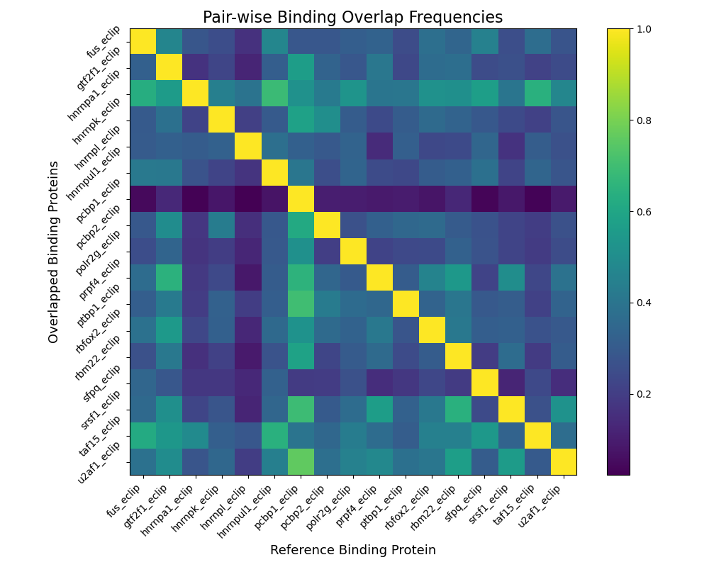

``bindexplore``
===============

If you are interested in taking N BED files for N different binding
experiments, you can visualize pair-wise binding overlaps across all
experiments to select candidate pairs for BindCompare. This script,
right now, can only be run from the terminal:

.. code-block:: bash

   bindexplore -s SCOPE -n NAME -b <bed_file_1> <bed_file_2> ... <bed_file_n>

The ``scope`` value essentially bins the genome into bins of size
``scope``. Then, it uses this size to search for overlaps within each
bin. Then a heatmap is generated to visualize binding overlaps and can be
seen below. The suggested scope/bin size is around 1000bp but experimenting
with this value is very easy. 

The math for each cell is the number of reference binding sites
found in overlayed sites divided by the number of reference binds. This means
for two values, there are two intersection values calculated, each scaled by
the number of reference values. The ``name`` flag allows you to specify a name for the experiment that is the prefix
for the provided outputs. 

The two outputs are the explore heatmap shown below and a 
CSV table that includes the values that the explore heatmap is based upon. 

In this example, we are comparing 17 *H. Sapiens* RNA Binding Proteins. 
Observing this matrix, we can see specific pairs of proteins that have high binding overlaps genome-wide. 
Once such pair is  HNRNPA1 and SFPQ (almost all SFPQ binding sites seem to overlap with a HNRNPA1 RNA binding site).
These pairs would be excellent canidates for ``bindcompare`` experiments. 
