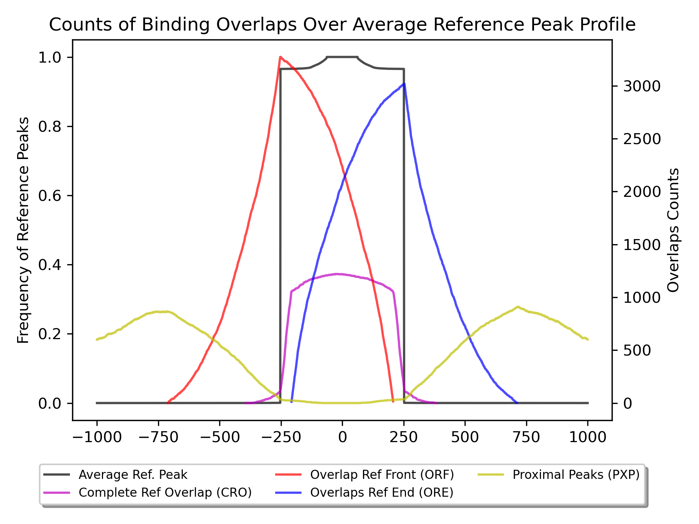
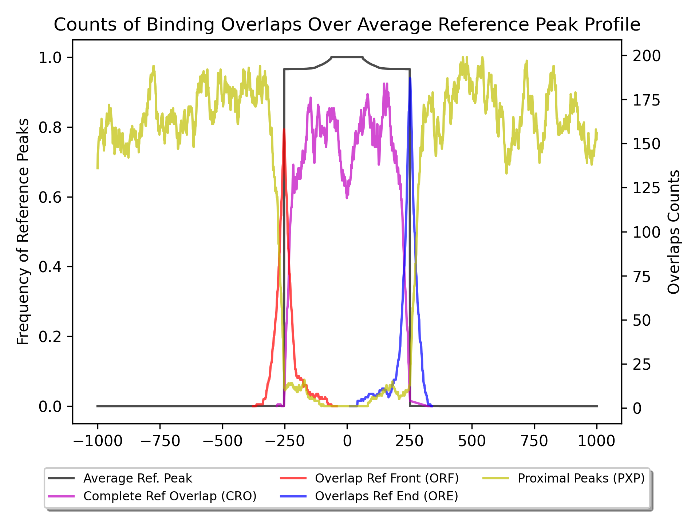

BindCompare User Guide
======================

This guide will walk you through the BindCompare workflow, how to choose a scope, how to interpret BindExplore results, and how to understand the overlap profiles.

Workflow
########

The BindCompare workflow consists of three main steps. Make sure that you have properly peak-called your data prior to using the BindCompare platform. If you are interested in gene/sequence information, make you have the appropriate respective genome GTF file or FASTA file.

**BindExplore**:

`bindexplore` analyzes binding overlaps across . This step includes generating heatmaps and CSV files that summarize the overlap of binding sites across different conditions.

3. **BindCompare**:
   - Use the `bindcompare` tool to compare binding interactions between different conditions or proteins.
   - This step involves generating detailed overlap profiles and other visualizations.

4. **CompExp**:
   - Run the `comparexp` tool to perform additional comparative analyses and generate comprehensive reports.

Interpreting and Using BindCompare
##################################

Choosing a Scope
----------------

The scope determines the region around each reference binding site to be considered for overlap analysis. Choosing an appropriate scope is crucial for accurate interpretation:

- **Default Scope**: The default scope is typically set to 2 kb, which includes the DNA binding site and 1 kb upstream and downstream.
- **Adjusting Scope**: Depending on your data and research question, you may need to adjust the scope. For instance, if you are studying interactions over a larger genomic region, you might increase the scope.

Consider the biological context of your study when choosing the scope. A larger scope may capture more interactions but could also introduce more noise.

Interpreting BindExplore
-------------------------

BindExplore generates visualizations and data that help you understand the binding interactions:

Choosing a Bin Size
+++++++++++++++++++
Choosing a bin size makes a large impact on the quality of your results. Generally, it is recommended to try a bin size of around 1000bp and determine the quality of your results. 

If the yielded results seem overly diluted (i.e. you are capturing too many overlaps) decreasing the bin size will decrease the number of captured overlaps. Conversely, if the bin size is too small, correlation scores will likely be very low and will not reveal combinatorial patterns.

Normalization and Binning
+++++++++++++++++++++++++

BindExplore normalizes the interaction scores by scaling counts based on the number of reference peaks. This prevents skewing results towards proteins with low specificity. It also allows us to compare all pairs within the same 0-1 range. 

If two peaks from different datasets fall within the same bin (e.g., 5 kb) but do not strictly overlap, they are still considered in the intersection. Bins are used for intersecting lists rather than individual peaks, which helps in summarizing the binding interactions more effectively.

Why is Protein A vs B different from Protein B vs A?
++++++++++++++++++++++++++++++++++++++++++++++++++++

The order of comparison matters due to normalization. When comparing A vs. B, the peaks from A are normalized against the number of peaks in B, and vice versa. This allows for accurate proportional comparisons, highlighting differences in binding specificities between the two datasets.

.. image:: ./images/explore.png
   :align: center
   :width: 220

For example, in the figure above, we have run `bindexplore` on 17 RNA binding proteins (RBPs). When HNRNPA1 is the overlapped binding protein, correlation matrix values are quite high (see row 3). However, when HNRNPA1 is the reference (column 3), correlation matrix values are much lower. This indicates that HNRNPA1 has low specificity and bins along with many different RBPs but few RBPs, such as TAF15, appear alongside all HNRNPA1 sites with high frequency. 

Interpreting bindcompare
------------------------

The overlap profile plot is a key output of BindCompare, providing detailed insights into binding interactions. A comprehensive interpretation guide is provided in the `bindcompare docs page <https://github.com/pranavmahabs/bindcompare/blob/main/docs/bindcompare.rst>`__. 

Choosing a Scope
++++++++++++++++
We have used a default of 1000bp scope region when comparing DNA peaks. While comparing RNA peaks (smaller size), we used a smaller scope area of 250bp. We suggest that the user choose a scope/bin size reflecting the use case. Selecting a larger bin size would pick up more distal co-binding, while a smaller bin size would be more stringent. In our experience, the default 1000bp scope region works for DNA-DNA and DNA-RNA comparisons. The scope size of 250bp works for RNA-RNA comparisons.

Overlap Profiles
++++++++++++++++
Here, we will provide a concrete example and how it could be interpreted.

Here we have two comparisons, first TAF15 binding compared to FUS DNA binding. 

Next we have TAF15 DNA binding compared to its RNA binding.

Looking at the first plot, we can see that a large number of FUS binding sites bind towards the beginning or end of a TAF15 binding site with much fewer occurring in the extended scoped region. This indicates that FUS positions itself near TAF15 binding. On the other hand, when comparing TAF15 DNA binding to its RNA binding, we see that while there are 100s of sites where DNA and RNA binding overlap, there is no clear skew along the scoped region.